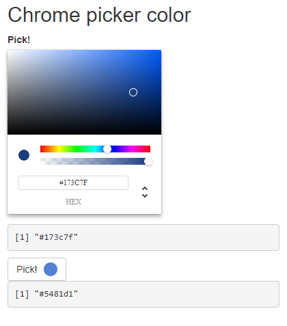

# reactcolors

> R interface to React library [react-color](https://casesandberg.github.io/react-color/). Powered by [reactR](https://react-r.github.io/reactR/index.html)!

[](https://travis-ci.org/pvictor/reactcolors)
[](https://www.tidyverse.org/lifecycle/#experimental)


## Installation

You can install from GitHub with:

``` r
remotes::install_github("pvictor/reactcolors")
```

## Example

All color pickers as rendered as htmlwidgets, so you can see the result in RStudio Viewer

```r
color_picker(
  picker = "Sketch",
  presetColors = c("#EFF3FF", "#C6DBEF", "#9ECAE1",
                    "#6BAED6", "#3182BD", "#08519C", "#112446"),
  label = "Pick a color:"
)
```


You can use them in Shiny applications (inline or through a button):

```r
library(shiny)

ui <- fluidPage(
  tags$h2("Chrome picker color"),
  chrome_picker("inline", "Pick!", inline = TRUE),
  verbatimTextOutput("res_inline"),
  chrome_picker("btn", "Pick!", inline = FALSE),
  verbatimTextOutput("res_btn")
)

server <- function(input, output, session) {
  output$res_inline <- renderPrint(input$inline)
  output$res_btn <- renderPrint(input$btn)
}

shinyApp(ui, server)

```




Launch the demo with:

```r
app_demo()
```


